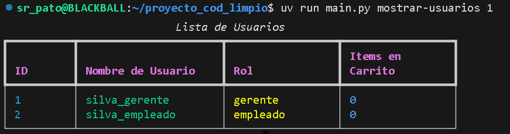
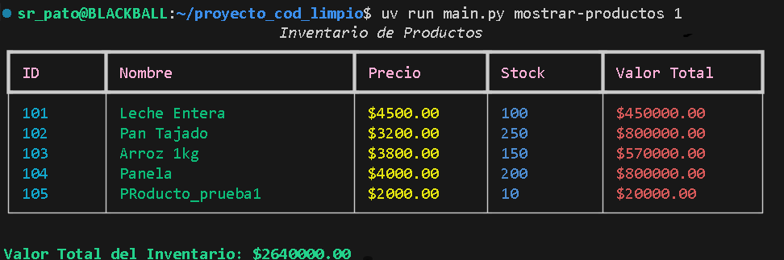
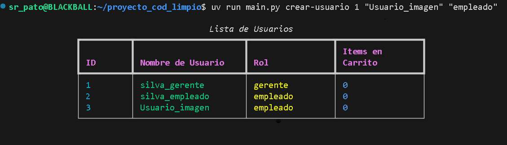
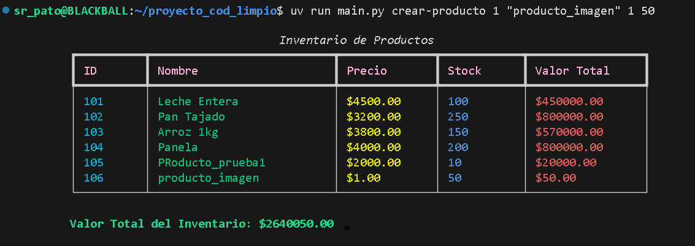

# Comandos del proyecto

## 1. Mostrar Usuarios
!!! info "Prerequisito"
    El usuario que intente realizar este comando debe tener como Rol "gerente".

Comando para mostrar el listado de usuarios.

```Bash
uv run main.py mostrar-usuarios a
```
>* `a` corresponde a el id del gerente (debe ser un numero entero).



---

## 2. Mostrar Productos
!!! info "Prerequisito"
    El usuario que intente realizar este comando debe tener como Rol "gerente".

Comando para mostrar el listado de productos en el inventario.

```Bash
uv run main.py mostrar-productos a
```
>* `a` corresponde a el id del gerente (debe ser un numero entero).



---

## 3. Crear Usuario
!!! info "Prerequisito"
    El usuario que intente realizar este comando debe tener como Rol "gerente".

Para crear un usuario se debe correr el siguiente comando:

```Bash
uv run main.py crear-usuario a "b" "c"
```
>* `a` corresponde a el id del usuario que quiere realizar el comando (debe ser un numero entero).
>* `"b"` corresponde al nombre del nuevo usuario, se debe escribir entre comillas dobles.
>* `"c"` corresponde al Rol que obtendra el nuevo usuario: `"gerente"` o `"empleado"`.



---

## 4. Crear Producto
!!! info "Prerequisito"
    El usuario que intente realizar este comando debe tener como Rol "gerente".

Comando para que un gerente cree un nuevo producto en el inventario.

```Bash
uv run main.py crear-producto a "b" c d
```
>* `a` corresponde a el id del gerente (debe ser un numero entero).
>* `"b"` corresponde al nombre del nuevo producto, se debe escribir entre comillas dobles.
>* `c` corresponde al precio del nuevo producto (debe ser un numero decimal).
>* `d` corresponde al stock inicial del nuevo producto (debe ser un numero entero).



---

## N. Mostrar Carrito

Comando para mostrar el carrito de un usuario específico.

```Bash
uv run main.py mostrar-carrito a
```
>* `a` corresponde a el id del usuario (debe ser un numero entero).


---


## 5. Agregar al Carrito

Comando para agregar un producto al carrito de un usuario.

```Bash
uv run main.py agregar-al-carrito a b c
```
>* `a` corresponde a el id del usuario (debe ser un numero entero).
>* `b` corresponde a el id del producto (debe ser un numero entero).
>* `c` corresponde a la cantidad (debe ser un numero entero).

---

## 6. Facturar Carrito

Comando para facturar el carrito de un usuario, mostrando el total a pagar y vaciando el carrito.

```Bash
uv run main.py facturar-carrito a
```
>* `a` corresponde a el id del usuario (debe ser un numero entero).

---

## 7. Quitar Producto del Carrito

Comando para quitar un producto del carrito de un usuario.

```Bash
uv run main.py quitar-producto-del-carrito a b
```
>* `a` corresponde a el id del usuario (debe ser un numero entero).
>* `b` corresponde a el id del producto (debe ser un numero entero).

---

## 8. Agregar Stock
!!! Prerequisito
    El usuario que intente realizar este comando debe tener como Rol "gerente".

Comando para que un gerente agregue stock a un producto existente en el inventario.

```Bash
uv run main.py agregar-stock a b c
```
>* `a` corresponde a el id del gerente (debe ser un numero entero).
>* `b` corresponde a el id del producto (debe ser un numero entero).
>* `c` corresponde a la cantidad a agregar (debe ser un numero entero).

---


## 10. Eliminar Producto
!!! Prerequisito
    El usuario que intente realizar este comando debe tener como Rol "gerente".

Comando para que un gerente elimine un producto existente en el inventario.

```Bash
uv run main.py eliminar-producto a b
```
>* `a` corresponde a el id del gerente (debe ser un numero entero).
>* `b` corresponde a el id del producto a eliminar (debe ser un numero entero).

---

## 11. Eliminar Usuario
!!! Prerequisito
    El usuario que intente realizar este comando debe tener como Rol "gerente".

Comando para que un gerente elimine un usuario existente en el sistema.

```Bash
uv run main.py eliminar-usuario a b
```
>* `a` corresponde a el id del gerente (debe ser un numero entero).
>* `b` corresponde a el id del usuario a eliminar (debe ser un numero entero).

