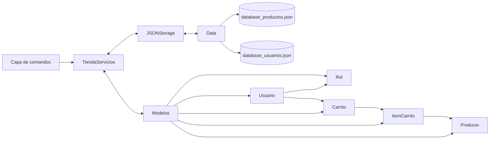

# Especificaciones de Ingeniería: Persistencia y Capas

En esta sección se detalla cómo el sistema gestiona la información del supermercado, garantizando que los datos de inventario y usuarios no se pierdan al cerrar la aplicación. Se ha optado por una **Arquitectura de Persistencia Desacoplada**, siguiendo principios de *Clean Code*.

## 🛡️ Arquitectura de Persistencia por Capas

El flujo de datos en el sistema no ocurre en un solo bloque de código, sino que atraviesa tres capas distintas. Esto permite que el sistema sea fácil de mantener y escalar.

### 1. Capa de Dominio (Modelos)
Ubicada en `src/gerencia_app/modelos/`. Aquí se definen las entidades puras:
* **Clase `Usuario`**: Define los atributos de empleados y gerentes.
* **Clase `Producto`**: Define las propiedades de los artículos del supermercado (precio, stock, nombre).
* *Estado*: Estos datos viven solo en la memoria RAM mientras el programa corre.

### 2. Capa de Servicios (Lógica de Negocio)
Ubicada en `src/gerencia_app/servicios.py`. Es el intermediario o "cerebro" del sistema:
* Recibe órdenes desde la CLI (ej. "vender producto").
* Coordina la actualización de los modelos.
* Indica a la capa de almacenamiento cuándo es el momento de guardar los cambios.

### 3. Capa de Infraestructura (Almacenamiento)
Ubicada en `src/gerencia_app/almacenamiento.py` a través de la clase `JSONStorage`:
* **Serialización**: Convierte los objetos de Python en formato de texto JSON.
* **Escritura/Lectura**: Gestiona la entrada y salida (I/O) de archivos físicos en el disco duro.

---

## 📊 Diagrama de Flujo de Datos

Este diagrama representa cómo viaja la información desde la interacción del usuario hasta el almacenamiento físico en los archivos `.json`.

