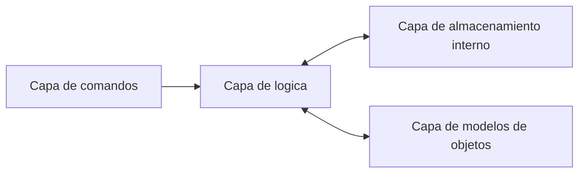

# Arquitectura y Decisiones de Diseño 🏗️

En esta sección se detallan las bases técnicas que sostienen el sistema de gestión del supermercado, justificando el uso de estándares de industria para garantizar un código profesional, mantenible y escalable.

---

## 📂 Estructura de Proyecto: `src` Layout

El proyecto implementa el patrón **src layout**, una convención recomendada en el ecosistema Python para evitar importaciones accidentales del código fuente y asegurar que las pruebas se ejecuten contra el paquete instalado.

!!! info "Beneficios del src Layout"
    * **Separación Clara:** El código de la aplicación está aislado de los archivos de configuración (`pyproject.toml`, `mkdocs.yml`, `tests/`).
    * **Consistencia:** Facilita el empaquetado y la distribución del software.
    * **Protección:** Evita que scripts en la raíz del proyecto interfieran con los módulos internos.

---

## 🏛️ Separación por Capas

Para este supermercado, se ha aplicado una **Arquitectura de Responsabilidad Única**, conectada de forma lineal para reducir el acoplamiento.

### Flujo de Dependencias

# Tabla de Arquitectura por Capas 🏛️

A continuación se detalla la estructura del sistema del supermercado, especificando la implementación real en el código y el principio de diseño aplicado a cada nivel.

| Capa | Implementación en el Proyecto | Responsabilidad y Decisión de Diseño |
| :--- | :--- | :--- |
| **1. Interfaz (Presentación)** | `main.py` (Typer) / `streamlit_app.py` | **Punto de Entrada:** Se encarga exclusivamente de la interacción con el usuario. Al estar aislada, permite que el sistema funcione en terminal o web sin cambiar la lógica interna. |
| **2. Aplicación (Servicios)** | `src/gerencia_app/servicios.py` | **Lógica de Negocio:** Actúa como mediador. Orquesta los "Casos de Uso" (ventas, registros, gestión de stock) coordinando las capas de Dominio e Infraestructura. |
| **3. Dominio (Modelos)** | `src/gerencia_app/modelos/` | **Entidades Puras:** Define las estructuras base (`Usuario` y `Producto`). No depende de ninguna base de datos ni librería externa, manteniendo la integridad de los datos en memoria. |
| **4. Infraestructura (Persistencia)** | `src/gerencia_app/almacenamiento.py` | **Persistencia Física:** Gestiona el acceso al disco duro. Utiliza `JSONStorage` para leer y escribir archivos físicos, abstrayendo al resto del sistema de cómo se guardan los datos. |
