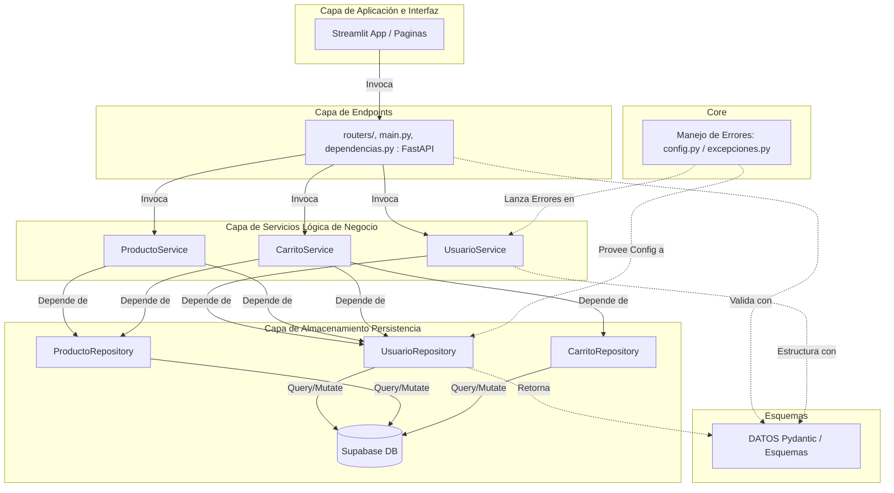

# Arquitectura del Sistema 🏗️

El proyecto está estructurado bajo los conceptos de **Arquitectura Limpia**. Las dependencias fluyen estrictamente desde las capas externas hacia el núcleo de la lógica de negocio.

## Descripción del Flujo de Componentes

La arquitectura del sistema está organizada en capas independientes y componentes transversales que interactúan bajo reglas específicas para garantizar el aislamiento de la lógica de negocio y la seguridad de los datos.

## 1. Flujo de Invocación Principal (Eje Vertical)

### Capa de Aplicación e Interfaz (Streamlit)

Representa el frontend de usuario. Su función es puramente visual y de captura de eventos; no procesa lógica de negocio pesada, sino que delega todas las operaciones realizando peticiones HTTP directamente a la API.

### Capa de Endpoints (FastAPI)

Es la puerta de entrada al backend. Los enrutadores (`routers/`, `main.py`, `dependencias.py`) reciben las solicitudes del frontend, administran el ciclo de vida de las dependencias y delegan la ejecución a los servicios correspondientes.

### Capa de Servicios (Lógica de Negocio)

Centraliza las reglas de negocio críticas del supermercado (`ProductoService`, `CarritoService`, `UsuarioService`). Es agnóstica de la procedencia de los datos e interactúa con el almacenamiento por medio de abstracciones (repositorios).

### Capa de Almacenamiento (Persistencia)

Los repositorios específicos (`ProductoRepository`, `UsuarioRepository`, `CarritoRepository`) encapsulan las consultas técnicas de lectura, escritura y mutación (*Query/Mutate*) hacia la instancia externa de **Supabase DB**, impidiendo el acoplamiento directo de la base de datos con las capas superiores.

---

## 2. Capas y Relaciones de Soporte Transversal (Eje Horizontal)

### Soporte de Sistema (Core)

#### Manejo de Errores y Excepciones (`excepciones.py`)

Define los errores de negocio que los Servicios lanzan ante fallas de validación o de privilegios de usuario.

#### Configuración del Sistema (`config.py`)

Provee de manera segura las credenciales de entorno necesarias para que los Repositorios puedan instanciar la conexión con la base de datos de Supabase.

### Modelos y Validación (Esquemas)

#### DATOS Pydantic / Esquemas

Actúan como contratos de datos inmutables y de tipado seguro en diferentes puntos clave del sistema.

**Valida con:**
- La capa de Endpoints (FastAPI) los utiliza para validar el formato de entrada de las peticiones de red (*Payloads*).

**Estructura con:**
- Los Servicios los usan para modelar y procesar entidades seguras antes de operar con ellas.

**Retorna:**
- Los Repositorios devuelven la información limpia estructurada bajo estos mismos modelos de validación.

## Diagrama de Capas y Componentes 🏛️

```mermaid
graph TD
    subgraph Capa de Aplicación e Interfaz
        ST[Streamlit App / Paginas]
    end

    subgraph Capa de Endpoints
        EP[routers/, main.py, dependencias.py : FastAPI]
    end

    subgraph Capa de Servicios Lógica de Negocio
        US[UsuarioService]
        PS[ProductoService]
        CS[CarritoService]
    end

    subgraph Capa de Almacenamiento Persistencia
        UR[UsuarioRepository]
        PR[ProductoRepository]
        CR[CarritoRepository]
        SB[(Supabase DB)]
    end

    subgraph Modelos y Validación [Esquemas]
        ESQ[DATOS Pydantic / Esquemas]
    end

subgraph Soporte de Sistema [Core]
        COR[Manejo de Errores: config.py / excepciones.py]
    end

    ST -->|Invoca| EP
    EP -->|Invoca| US
    EP -->|Invoca| PS
    EP -->|Invoca| CS

    US -->|Depende de| UR
    PS -->|Depende de| PR
    PS -->|Depende de| UR
    CS -->|Depende de| CR
    CS -->|Depende de| UR
    CS -->|Depende de| PR

    UR -->|Query/Mutate| SB
    PR -->|Query/Mutate| SB
    CR -->|Query/Mutate| SB
%% Flujos de datos transversales de Esquemas
    EP -.->|Valida con| ESQ
    US -.->|Estructura con| ESQ
    UR -.->|Retorna| ESQ
%% Soporte transversal de Core
    COR -.->|Lanza Errores en| US
    COR -.->|Provee Config a| UR
```

## Beneficios del Diseño 📂

* **Desacoplamiento:** La lógica de negocio no sabe ni le importa si los datos se guardan en Supabase, PostgreSQL o un archivo de texto; solo interactúa con la interfaz de los repositorios, Streamlit no sabe nada sobre la logica del negocio, simplemente hace el llamado a los end points y ellos a su vez desencadenan toda una reacción para que streamlit pueda mostrar lo que se pide.
* **Testabilidad:** Permite inyectar dobles de prueba (`MagicMock`) reemplazando por completo la capa de almacenamiento para validar las reglas de negocio sin conexión a internet.
